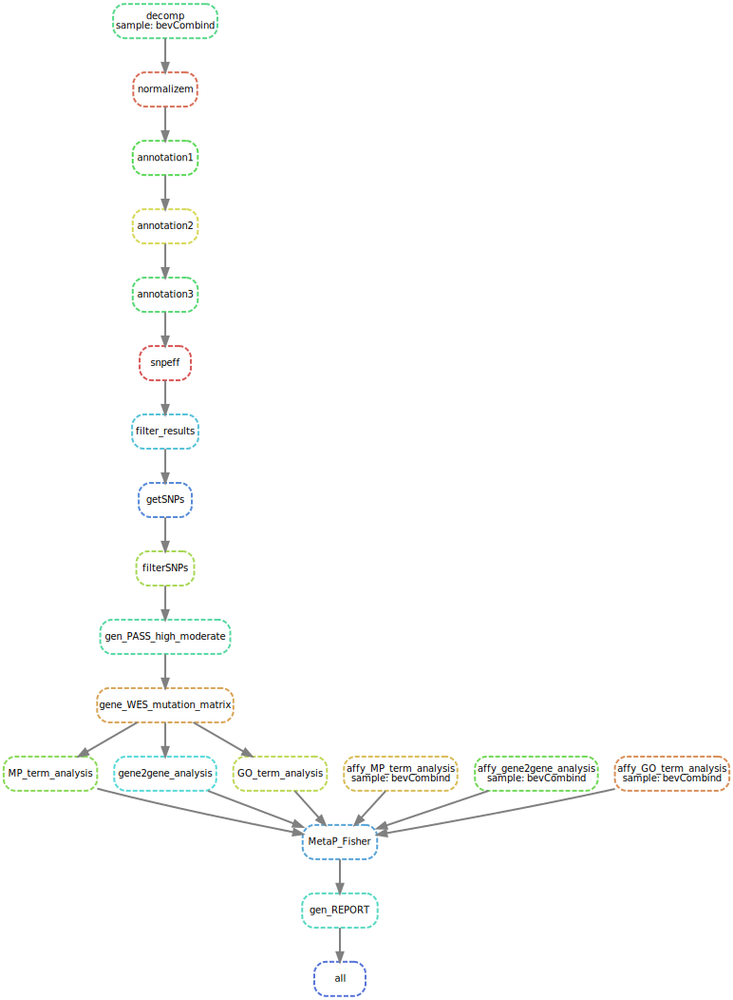

# Short_Variant_and_CNV_Pipeline
Bioinformatics pipeline on Conda Virtual Environment for Short Variant (WES) and Copy Number Variation Analyses


# DAG - Pipeline 's Flow
```
[]()
```
<p float="left">
  
   
</p>

# Program Requirements:
### Preinstalled on the system
- Anaconda - or just Conda (for virtual environment setup)
- Snakemake v5.4.4 (Or anything above that)
- Python3
- xlrd (for dealing with excel files)
- Flask
- Vt
- Vcfanno
- SnpEff
- Gatk 4.0 (For filtering of Short Variants)
- Scientific packages i.e (Pandas, Spicy, Numpy)

# Input Files Requirements:

## These files below are to be provided by the user
- **.vcf**
  * Variant Call Format file
  * Contains Short Variant called of all samples
  * Columns should be: ` #CHROM, POS, ID, REF, ALT, QUAL, FILTER, INFO, FORMAT, then individual samples`
- **.sqlite** 
  * A database file that has a table named `id_table` in it already
  * The table is user generated
  * Columns of the `id_table` should be: `ID, cases_controls`
  * ID is the sample id
  * Heart_Phenotype is either 0 or 1 (int). 0 is controlled group, 1 is cases group
  * This table will get accessed to separate the Controlled from Cases group
- **.bed**
  * **Put this BED file in the sqlite database above**
  * File that stores CNV discovery results from your desired method (SNPs array, WGS, WES)
  * SHOULD ALREADY BE FILTERED
  * Columns should be: ` chr, start, end, ID`
- **.fasta/.fa**
  * Reference file that you used for Short Variant Discovery
- **.fasta.fai**
  * Indexed file for the reference file
- **project_summary.txt**
  * A simple text file with a few line describing what the project is about
- **temp.anno, temp2.anno, temp3.anno**
	- These are the 3 scripts files used by **vcfanno** to annotate the SNP data. 
	- **IF run on Respublica or CHOP server**
		- Then nothing need to be modified in these files
	- **IF run on non-CHOP server**
		- Then these temp.anno, temp2.anno, temp3.anno files need to be modified a bit. 
		- Access each of these file to provide the accurate information on the location of these files listed below:
			- ExAC.r0.3.sites.vep.tidy.vcf.gz
			- cadd_v1.3.vcf.gz
			- ESP6500SI.all.snps_indels.tidy.v2.vcf.gz
			- clinvar_20170130.tidy.vcf.gz
			- clinvar_20160203_noUnicode.tidy.vcf.gz
			- HGMD_PRO_2016.1_hg19.vcf.bgz
			- dbsnp137.coding.variants.sift.prediction.bed.gz
			- rvis.hg37.primary.bed.gz
## These files are provided in the repository
- **go_def.txt**
	- Gene Ontology definitions
- **human_GO.txt**
	- Gene Ontology - Human Gene pairs
- **mp_def.txt**
	- Mammalian Phenotype definitions
- **human_MP.txt**
	- Mammalian Phenotype - Human Gene pairs
- **hg19_genes.bed**
	- Info on chromosome, gene start and end location
- **rare_disease.lua**
	- Lua file for the annotation step


# Operation Instruction

### Assumptions
- All .vcf, .bed .fa, .fai, and .sqlite files are in subdirectory of the Snakemake and config.yaml files

### Quick To-Do list to run the pipeline

  * Create a new environment in Conda
	  * Install all of the above necessary packages
	  * **Note** - Get Scipy from conda-forge channel 
  * Clone this github repository
  * Move all required file into this repository, preferably make a folder and put them all in there
  * Make sure that all files above are downstream from the Snakemake file
  * Edit the config.yaml
  * Execute the Snakemake command to run the pipeline

## DON'T USE ABSOLUTE PATH IN THE CONFIG.YAML FILE
## EVERYFILES NEEDED FOR THE PIPELINE MUST BE AT LEAST AT THE SAME OR 1 DIRECTORY BELOW THE SNAKEFILE


Once all files are in the repo and the config file is edited, then in the folder where the snakemake and config.yaml files are located, run:
```
snakemake --use-singularity -s Snakefile_wes --configfile config.yaml -d . -j -p --max-jobs-per-second 10 --latency-wait 30
```

**The options/flags above are:**
- -s : Point to the location of the Snakemake file (in this case, it is in the current directory)
- --configfile : Point to the location of the config file
- -d : Specifying working directory. The "." after -d is to show the working dir is at the current folder
- -j : Set available cores
- -p : Print shell command that will be executed
- --latency-wait: Define the number of seconds to wait for a file to show up after that file has been created

-------------------------

- After running the command, sit back, relax and wait for the pipeline to finish. Then run Flask as below:
	  * Run `python3 generate_REPORT.py --database put_sqlite_database_path_here`
	  * Go to google chrome
	  * Type in `localhost:5000` to see the webpage


# Output

* The output is in data/endpoints/ – relative to where the Snakefile is
	* The output includes the {yoursamplename}_homepage.html file and the **index** folder and its content. 
* Relative to where the Snakemake file is, the pipeline will make `data/interim/` folder to store the intermediate files.

# Notes

- The pipeline was tested on a 2009 iMac with 2 cores, 10Gb of ram and took 18 hours to run (A normal computer these days should have better specs than this system)
	- Sample size was ~300 SNP and CNV samples
- Speed may vary depending on hardware and size of your data

  
# Discussion

Please direct any questions towards      |                           |
---------------------------------------- |:-------------------------:|
Mike Xie                                 | xiem1@email.chop.edu      |
Nhat Duong                               |     |
 
 
# Citation
- Adrian Tan, Gonçalo R. Abecasis and Hyun Min Kang. Unified Representation of Genetic Variants. Bioinformatics (2015) 31(13): 2202-2204
- Pedersen, B.S., Layer, R.M. & Quinlan, A.R. _Vcfanno_: fast, flexible annotation of genetic variants. _Genome Biol_  **17,** 118 (2016). https://doi.org/10.1186/s13059-016-0973-5
- Cingolani P, Platts A, Wang le L, et al. A program for annotating and predicting the effects of single nucleotide polymorphisms, SnpEff: SNPs in the genome of Drosophila melanogaster strain w1118; iso-2; iso-3. _Fly (Austin)_. 2012;6(2):80‐92. doi:10.4161/fly.19695
- Van der Auwera GA, Carneiro M, Hartl C, Poplin R, del Angel G, Levy-Moonshine A, Jordan T, Shakir K, Roazen D, Thibault J, Banks E, Garimella K, Altshuler D, Gabriel S, DePristo M, 2013 _CURRENT PROTOCOLS IN BIOINFORMATICS 43:11.10.1-11.10.33_

